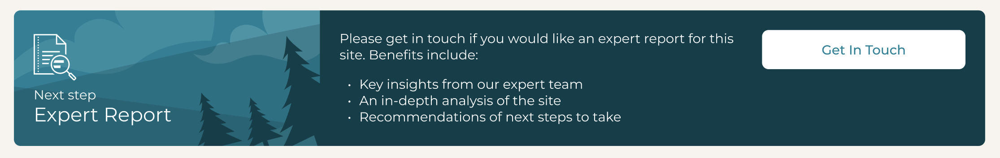

# Cultivo - take home programming assignment

## Instructions

The task is to build a responsive banner / card. The design is available in Figma [here](https://www.figma.com/file/HrbZ3oB1inqZuAi9VVdQb4/CTA-Banner?type=design&node-id=1%3A9&mode=design&t=wNbdC14RMG5QaNSk-1). If you cannot access this then please ask your Cultivo contact ASAP - you cannot complete the assignment without the design.



1. Fork this repository to your own GitHub account.
2. Implement the component and include it in `app/page.tsx`
3. Commit and push all changes to your fork.
4. Reply by email to your Cultivo contact person:
  * Include a link to your forked repository
  * No need to implement this, but please explain in as much detail as possible how we could extend the solution so that:
    * we send a Slack message to the team for the customer message
    * instead of using local storage to keep track of whether the form was submitted we keep track of that server-side, so that the appropriate banner state is displayed no matter which device the user logs into

#### Development notes
* Implement this responsive banner as a TypeScript React component. **Code quality** and **pixel perfect execution** are equally important.
* When the button is clicked display the `ContactFormDialog` component provided.
* It may be relevant to know that this is just one of many possible banners on the platform - they would all follow the same style but use different text, imagery and button action.

## Getting Started

First, install dependencies:
```bash
npm install
```

Next, run the development server:

```bash
npm run dev
# or
yarn dev
# or
pnpm dev
# or
bun dev


## Setting up a Slack Webhook
    1. Create a new Slack app in  Slack workspace.
    2. Activate Incoming Webhooks from the Slack app settings.
    3. Create a new Webhook URL and associate it with a channel in our Slack workspace where we want to receive the messages.
    4. Modify handleFormSubmit function to make an HTTP request to  backend server instead of just logging the message. On the server side, we set up an endpoint to receive form submissions. This endpoint should validate the incoming data and then use the Slack Webhook URL to send the message to Slack channel. This can be done by making an HTTP POST request to the Webhook URL with a JSON payload containing the message text.

## Setting up Database to track submission 
   1. we set up a database to store submission states(banner state) associated with users. once form is submitted, database will be updated with submission state for user. React component will be modified to fetch submission state from the backend when component mounts instead of reading from local storage


